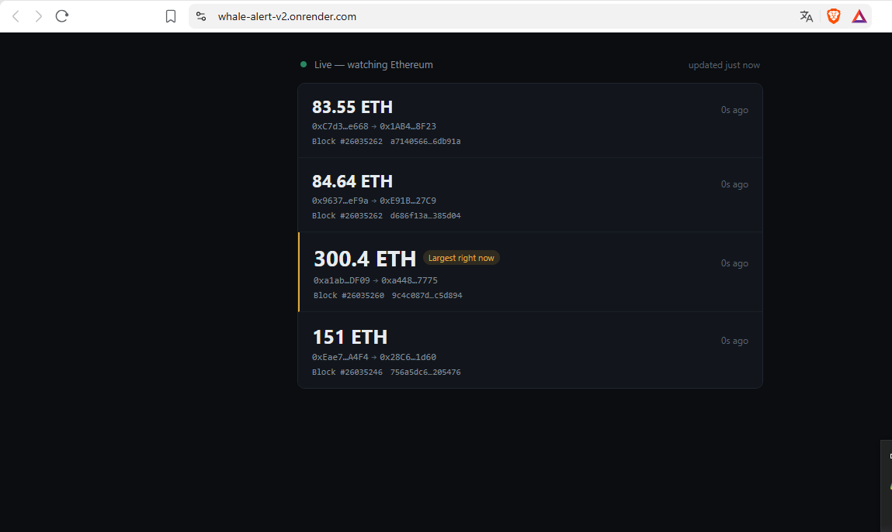

# Whale Alert v2.0

Real-time detection of large Ethereum transactions ("whale" transactions) with atomic deduplication via Redis.



## Problem

Large token/ETH movements often signal market-moving events (exchange deposits/withdrawals, OTC deals, whale accumulation). Manually watching a block explorer for these transactions is impractical, and naive polling approaches tend to fire duplicate alerts for the same transaction when data is refetched.

## Solution

A background listener continuously monitors new Ethereum blocks, filters transactions above a configurable ETH threshold (default: 50 ETH), and uses Redis' atomic `SETNX` operation to guarantee each qualifying transaction triggers exactly one alert — even under concurrent processing.

## Architecture

┌─────────────┐ ┌──────────────┐ ┌───────────────┐
│ Ethereum │ │ Listener │ │ Redis │
│ (Infura RPC)│─────▶│ (background │─────▶│ SETNX dedup │
│ │ │ asyncio │ │ (atomic check) │
└─────────────┘ │ loop) │ └────────┬────────┘
└──────┬────────┘ │
│ │ new? → yes
▼ ▼
┌──────────────┐ ┌────────────────┐
│ blockchain.py│ │ SQLite (WAL) │
│ fetch_whale_ │────────▶│ alerts table │
│ transactions │ └────────┬────────┘
└──────────────┘ │
▼
┌────────────────┐
│ FastAPI REST │
│ /alerts │
└────────┬────────┘
│ polling
▼
┌────────────────┐
│ Frontend (JS) │
│ live feed │
└────────────────┘


## Stack

- **Backend:** FastAPI, SQLAlchemy, SQLite (WAL mode)
- **Blockchain:** Web3.py via Infura RPC
- **Deduplication:** Redis (`SETNX`)
- **Frontend:** Vanilla HTML/CSS/JS, dark theme, polling-based
- **Config:** pydantic-settings (`.env`)

## Running locally

Requires Redis running:
```bash
sudo service redis-server start
```

Backend:
```bash
cd whale-alert-v2
python3 -m venv venv
source venv/bin/activate
pip install -r requirements.txt
cp .env.example .env   # fill in your Infura API key
uvicorn app.main:app --reload --port 8002
```

Frontend:
```bash
cd frontend
python3 -m http.server 5502
```

## API

| Method | Endpoint         | Description                          |
|--------|------------------|---------------------------------------|
| GET    | `/alerts/`       | List detected whale transactions      |
| GET    | `/alerts/{id}`   | Get a single alert by ID              |
| GET    | `/health`        | Health check                          |

## Technical decisions

- **Why Redis SETNX over a DB unique constraint:** `SETNX` is atomic at the Redis level and avoids race conditions when multiple transactions in the same block are processed concurrently, without needing DB-level locking or catching integrity errors.
- **Why a background listener instead of on-demand polling:** whale transactions need to be caught as they happen; on-demand analysis (as in Risk Monitoring Engine) doesn't fit a continuous-monitoring use case.
- **Threshold as config, not hardcoded:** the 50 ETH threshold lives in `.env`, allowing tuning without code changes.
- **SQLite over Postgres (local):** `psycopg2-binary` had build issues on Python 3.14 locally; SQLite in WAL mode is sufficient for this scale. Postgres is planned for the Render deployment.

## Challenges & learnings

- Initial version without Redis produced duplicate alerts when the same block was reprocessed after a listener restart — solved by persisting dedup keys in Redis instead of in-memory, so restarts don't lose dedup state.
- Frontend font size scaling by relative transaction size required capping the scale factor, since occasional 1000+ ETH transactions were breaking the layout.

## License

MIT
